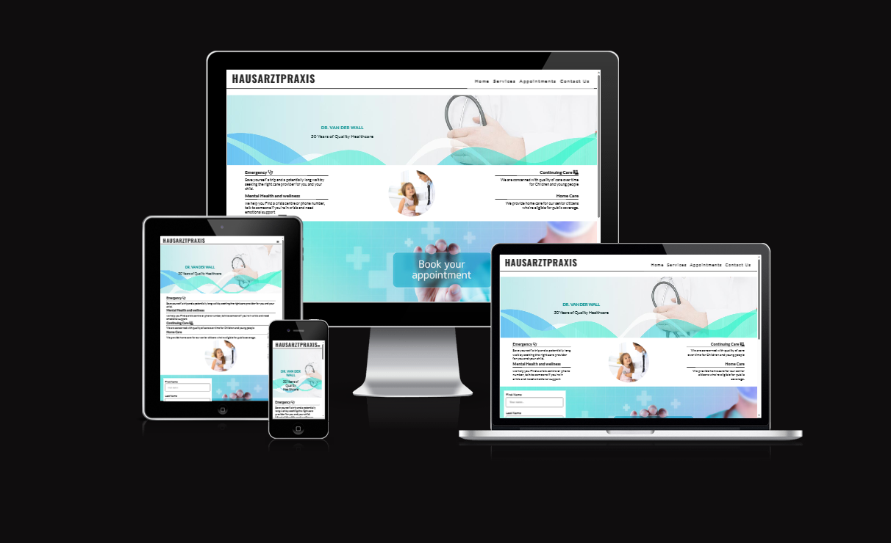
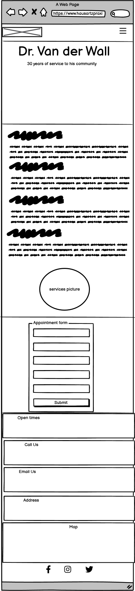
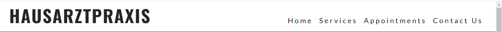
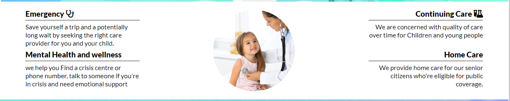
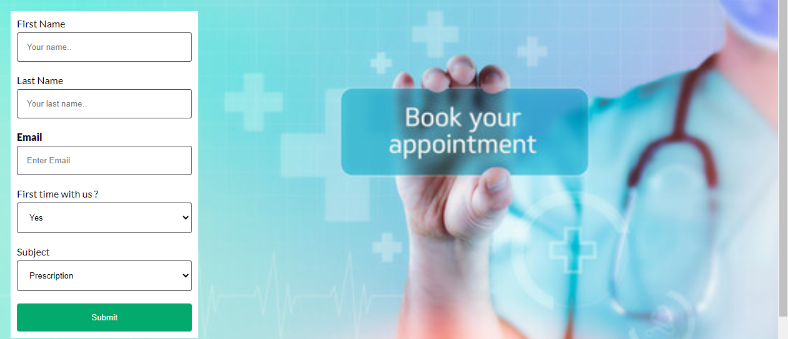
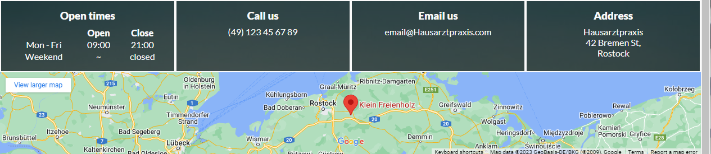
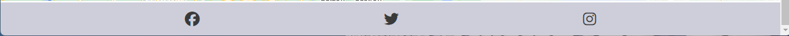

# HAUSARZTPRAXIS Dr. van der Wall 

 Hausarztpraxis is a medical clinic to improve the health of the population they serve. Responding to people's expectations. Providing financial protection against the costs of ill-health.
 The website includes the healthcare services provided such as:
 
- Emergency services.
- Continuing Care. 
- Mental Health and wellness.
- Home Care.

Through the website, the clinic allow patients to book their medical appointments online for non emergency cases. A section dedicated to appointments required some basic information and these informations are instanstly process by nurses at te clinic saving the patients and the doctor a lot on he consultation time.

The address and contact information are also available. The live link can be found here - [hausarztpraxis](https://d9fal.github.io/PP1-Sanitz-clinic/)

  ## Site Owner Goals
  
  - To provide the user with a reliable and secure platform, with focus healthcare.
  - To provide the user with a website that is easy and fast to navigate. fully responsive. 
  - To enable the user to locate Hausartzpraxis by clicking on the google map link. 
  - To allow Hausartztpraxis to deliver necessary information to its patients as fast as possible.    
  
## User Stories

- First time user/patient
  
  - As a first time user, it important to know the main goal of the site and a quick summary of the services provided.
  - As a first time user I want to be able to intuitively navigate the website and without any frustration.
  - As a first time user, once in the needed section, I want to be able to browse the contents without getting off topic. 
  - 
- Returning User/patient
  
  - As a returning user I want to match or surpass the same level of satisfaction during my first time using the website even if new sections or services were added to the website.
  - As a returning user I want to be able to find the clinic information and location.
  
- Frequent User/patient
  
  - I want a section newsletter added to the website to brodcast health information from the local govment, and or reminder to certain group of patients vaccinations (flu vaccine) that they may be vulnerable to. 
  - As a frequent user I want to be able to enjoy the online appointment services.
  - As a frequent user I want to be able to give my opinions on services received in the clinic on this website and read other users ratings.
- 
 ## Design

### Imagery

The imagery used on this website are purposly choosen to bring the user to stay motivated while scrolling through the website. It improves the overall experience. We are aware of the fact that most users are on the website because they or their love ones are having health issues. Therefor we provide a good contrast so the users can properly navigate and find the right informatiions in short time. 

### Colours

The color scheme of the website is white, light-green and light-blue providing a good background to the dark grey font used. 

### Fonts

lato font is the main font used throughout the whole website. This font was imported via [Google Fonts](https://fonts.google.com/) . I'm using Sans Serif as a backup font, in case for any reason the main font isn't being imported into the site correctly.

## Wireframes

 Wireframes were produced using Balsamiq.

 

 
 
Desktop Wireframe
 
 
 

 

 
 
Mobile Wireframe

 
 

## Features

- Navigation

  - The navigation bar includes links to Logo (position: right), Home, Services, Appointments, Contact-Us.
  - The bar has a fixed position, a shadow box and a higher z indice, allowing the bar to stay visible while the user navigates through the sections.
  - With the bar always visible, the user can jump from one section to another without having to scroll up. 
  
  
  
- The landing Page 

  The landing page is artistically designed to first gain the patient confidence and allow the clinic to share a quick description of its ojectives.
    
  

    
- Services section

    The Services section gives itemised details of services provided in the clinic.
    
  

- Appointments section

  This section is added to optimise the use of cell phones, ipads, androids, laptops, desktop, and avoid the need to call (phone line busy), to walk in the clinic and wait in line before getting a simple appointment. 

  It includes a form where the patient information like Name, Last Name, email and Object are to be filled in. email is a required input so that the clinic can get back to the patient if more information are needed. 
  
  It allows the patient to enjoys a quality service without having to sit in the clinic for long time. Nurses will have time to digitally process and prepare the patient file before the patient's arrival.  

  

- Contact-Us Section

    The Contact-Us section the most used section by the user, includes an iframe with an embeded google map displaying the location of the clinic.
    The phone number, email, and address are also provided in this section.  
    
 
  

- The Footer
    The footer section includes links to the clinic social media pages.
    Patients iterrested to have an idea of our patients satisfaction use mostly the social media site and read the comments.
    

## User Stories and User Stories Testing"
## Testing

 
### Validator Testing

* HTML
        No errors were returned using W3C html Validator
        [w3w html Validator Results](https://validator.w3.org/nu/#textarea)
* CSS
        No errors were returned using W3C css Validator
        [w3w css Validator Results](https://jigsaw.w3.org/css-validator/validator)

* Accessibility
  
  

  
The accessibility score is 85% showing that pictures colors and fonts offers a good contrast. I think i can improve it by reducing the size of the pictures 
### Form Testing

* The form has been tested and it is not possible submit without the required inputs fields (email) being filled in.

### Links Testing
-All the links on the webpage have been tested and work really good

### Browser Testing

- The page was opened in firefox, chrome, microsoft edge, safari with no error. 

### Device Testing

- The responsiveness test was conducted on iphone 12, thinkpad, desktop samsung 8, ipad and the results are satisfying.

## Friends and Family User Testing

the site and documentation were reviewed by Friends and family members to point out any bugs and/or user experience issues.

## Bugs

During the programming, errors and bugs were dealt with as it progress. google chrome dev tool "inspect" was used. We are planning to design a serie of test for the website.  

## Teshnologies Used

- HTML5
- CSS

## Deployment

This project was deployed using GitHub pages. The steps are as followed:

* Click on "Settings" on the GitHub repository page.
* Select "Pages" on the left menu bar.
* Make sure "Main" is selected in "Branch" dropdowm menu under "Source". 
* Click "Save" .
* Wait a few minutes (2mn - 4mn ) and Under "Environements" click on "deployments" and the Deployment link should be available. 

The live link is [Hausarztpraxis](https://d9fal.github.io/PP1-Sanitz-clinic/)

## Frameworks - Librairies - Programs Used

- [Codeanywhere](https://codeanywhere.com/) - used as IDE to write, edit and compile the code.
- [W3C](https://validator.w3.org/) - To validate HTML & CSS.
- [Chrome Dev Tools](https://developer.chrome.com/docs/devtools) - Used to test, verify, modify thewebsite while writting the program in codeanywhere   and tweaking, including testing responsiveness and performance.
- [GitHub](https://github.com/) - Used for version control and hosting.
- [Am I Responsive](https://amiresponsive.co.uk/) - Used to verify responsiveness of website on different devices.
- [Google Fonts](https://fonts.google.com/) - Used to import and alter fonts on the page.
- [Font Awesome](https://fontawesome.com/) - Used for icons in footer.
- [Balsamiq](https://balsamiq.com/) - Used to generate Wireframe images.

## Ressources Used

- [stack Overflow](https://stackoverflow.com/)
- [geesforgeeks](https://www.geeksforgeeks.org/)
- [W3Schools](https://www.w3schools.com/)
- To structure my readme.md, I used Mind Yoga by Ali Okeeffe readme file template [readme.md](https://github.com/AliOKeeffe/mindyoga)

## Aknowledgments

My Mentor Antonio for the 3 productive sessions we had. 