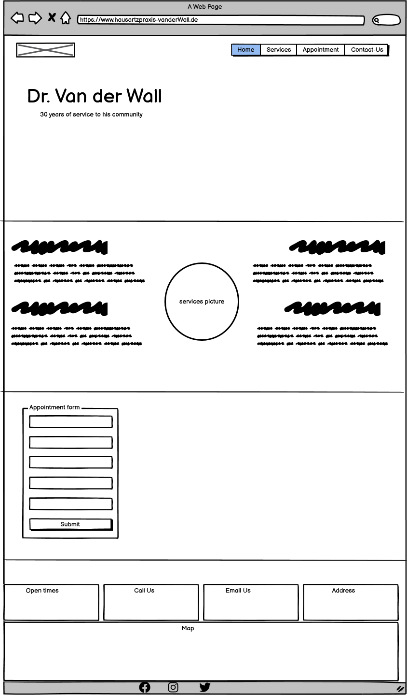

# HAUSARZTPRAXIS Dr. van der Wall 

 Hausarztpraxis is a medical clinic to improve the health of the population they serve. Responding to people's expectations. Providing financial protection against the costs of ill-health.
 The website includes the healthcare services provided such as:
 
- Emergency,services.
- Continuing Care. 
- Mental Health and wellness.
- Home Care.

Through the website, the clinic allow patients to book their medical appointment online for non emergency cases. A section dedicated to appointments required some basic information and these informations are instanstly process by nurses at te clinic saving the patients and the doctor a lot on he consultation time.

The address and contact information is also available. The live link can be found here - [hausarztpraxis](https://d9fal.github.io/PP1-Sanitz-clinic/)

  ## Site Owner Goals
  
  - To provide the user with a reliable and secure platform, with focus healthcare.
  - To provide the user with a website that is easy and fast to navigate. fully responsive. 
  - To enable the user to locate Hausartzpraxis by clicking on the google map link. 
  - To allow Hausartztpraxis to deliver necessary information to its patients as fast as possible.    
  

 ## Design

### Imagery

The imagery used on this website are purposly choosen to bring the user to stay motivated while scrolling through the website. It improves the overall experience. We are aware of the fact that most users are on the website because they or their love ones are having health issues. Therefor we provide a good contrast so the users can properly navigate and find the right informatiions in short time. 

### Colours

The color scheme of the website is white, light-green and light-blue providing a good background to the dark grey font used. 

### Fonts

lato font is the main font used throughout the whole website. This font was imported via [Google Fonts](https://fonts.google.com/) . I'm using Sans Serif as a backup font, in case for any reason the main font isn't being imported into the site correctly.

## Wireframes

 Wireframes were produced using Balsamiq.

 

 
 
Desktop Wireframe

 

 
 
Mobile Wireframe

 

## Features

 
## Testing

 
### Validator Testing

* HTML
        No errors were returned using W3C html Validator
        [w3w html Validator Results](https://validator.w3.org/nu/#textarea)
* CSS
        No errors were returned using W3C css Validator
        [w3w css Validator Results](https://jigsaw.w3.org/css-validator/validator)

* Accessibility
  
The accessibility score is 85% showing that pictures colors and fonts offers a good contrast. I think i can improve it by reducing the size of the pictures 
### Form Testing

* The form has been tested and I would not be possible not submit without the required inputs fields (email) being filled in.

### Links Testing
-All the links on the webpage have been tested and work really good

### Browser Testing

- The page was opened in firefox, chrome, microsoft edge, safari with no error. 

### Device Testing

- The responsiveness test was conducted on iphone 12, thinkpad, desktop samsung 8, ipad and the results are satisfying.

## Teshnologies Used

- HTML5
- CSS

## Deployment

This project was deployed usimg GitHub pages. The steps are as followed:

* Click on "Settings" on the GitHub repository page.
* Select "Pages" on the left menu bar.
* Make sure "Main" is selected in "Branch" dropdowm menu under "Source". 
* Click "Save" .
* Wait a few minutes (2mn - 4mn ) and Under "Environements" click on "deployments" and the Deployment link should be available. 

The live link is [Hausarztpraxis](https://d9fal.github.io/PP1-Sanitz-clinic/)

## Frameworks
## Credits

